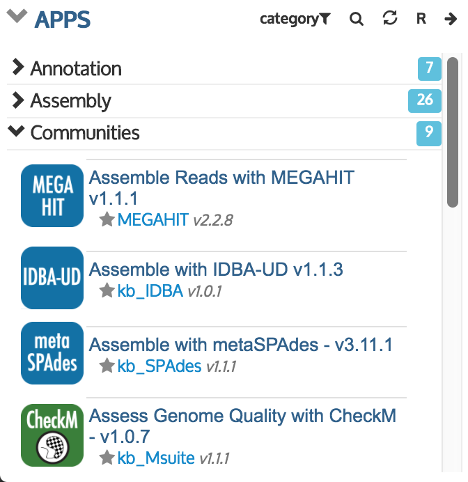

# Narrative Quick Start



#### [Download the printable version of this Quick Start guide](https://kbase.us/wp-content/uploads/2017/03/KBase_QuickStart_V8_March2017.pdf)

\(Last updated March 2017\)

### **What is a Narrative?**

In KBase, you can create shareable, reproducible workflows called **Narratives** that include data, analysis steps, results, visualizations and commentary. This Quick Start provides an overview of how to create and use the features of Narratives. For more detailed information, please see the [Narrative Interface User Guide](https://kbase.us/narrative-guide/).

### **Step 1. Sign up for a KBase user account**

To begin using KBase, you will first need to [Sign up for a KBase Account](https://kbase.us/sign-up-for-a-kbase-account/). You can now use your existing Google or Globus username and password to get a free KBase account.

### **Step 2. Sign in to the Dashboard**

After you sign in, you will be taken to your Dashboard \(details of which can be found [here](https://kbase.us/narrative-guide/your-dashboard/)\). From the Dashboard, you can open your existing Narratives, access others that have been shared with you, and create new Narratives. These Narratives can be accessed at [narrative.kbase.us](https://narrative.kbase.us/).  
If you are a new user, your Dashboard will be mostly empty, since you haven’t created any Narratives yet.

### **Step 3. Create a new Narrative**

Click the “+ New Narrative” button in the Dashboard to open a new untitled Narrative. A “Welcome to the Narrative Interface” box offers some suggestions for adding content to your Narrative. You can collapse or delete this box using the “…” menu in its top right corner.

**Try the Narrative tour!**

Select the “Narrative Tour” from the Help menu. This new feature walks you through the user interface, pointing out various useful aspects of it. We recommend taking the tour even if you’ve used KBase before, as it will help familiarize you with the new version.  

### **Step 4. Find data to analyze**

To load data to your Narrative, click the “Add Data” button, which can be found under the Analyze tab near the top left of the Narrative. The [Data Browser](https://kbase.us/narrative-guide/explore-data/) will slide out with tabs that show several data sources.

You can choose a dataset already in KBase by selecting any of the first four tabs. The _Example_ tab, for instance, contains sample data from KBase’s reference data collection that can be used to try out the apps.

The _Import_ tab allows you to upload your own data. KBase currently supports upload of a variety of data types. Please see the [Data Upload/Download Guide](https://kbase.us/data-upload-download-guide/) for more information.

_**Note that any data you upload to KBase is private unless you choose to share it.**_

### **Step 5. Add data to your Narrative**

When you hover over a [data object](https://kbase.us/narrative-guide/explore-data/) in the Data Browser, an “Add” button will appear to its left. Click this button to add the data to your Narrative.

Notice that the data object now appears in your Data Panel. Once you finish adding data, exit the Data Browser by clicking either the “Close” button at the bottom left of the browser window or the arrow at the top right of the Data Panel.

Don’t forget to periodically save your Narrative by clicking the “Save” button at the top right of the interface.  

### **Step 6. Choose an App** 

### \*\*\*\* 

Once you have added data to your Narrative, you can analyze it using one or more of the KBase apps listed in the Apps panel below your data.

There are options for filtering by category, name, input type, and more. You can designate apps you like as favorites using the star icon.

To add an app to your Narrative from the App Panel, click on its name or icon. You can get more information about an app by hovering over it in the App Panel until a “…” appears.

### **Step 7. Run the App**

Fill in all the required fields in your app. Note that some app fields are “smart” and know which data in your Narrative are valid input for those fields. These “smart” fields have a pulldown list of all the data objects from your Data Panel that you can choose from as input.

When all required fields have been filled out, click the green “Run” button near the top left of the app cell to start the analysis.

While the analysis is running, you will see the progress in the Job Status tab of the app box. When it finishes, the results will show up in the Result tab.

Please see [the KBase Apps section of the Narrative Interface User Guide](https://kbase.us/narrative-guide/run-apps-and-methods-to-analyze-your-data/) for more details on running apps.

### **Step 8. Share your Narrative**

All Narratives that you create are private by default. You can [make a Narrative public or share it ](https://kbase.us/narrative-guide/share-narratives/)[with specific collaborators](https://kbase.us/narrative-guide/share-narratives/) by clicking the “share” button near the top right of your Narrative.

### **Next steps and additional resources**

With these basic steps, you now can begin using the Narrative Interface to create Narratives and analyze data. An extensive set of tutorials is available:

* * [Narrative Interface User Guide](https://kbase.us/narrative-guide/)
  * [Data Upload and Download Guide](https://kbase.us/data-upload-download-guide/)

